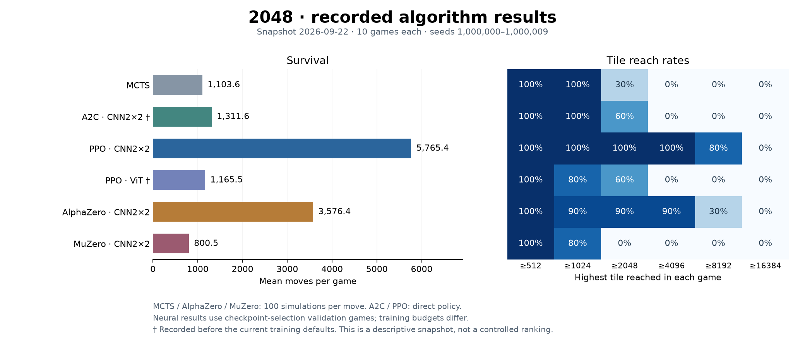
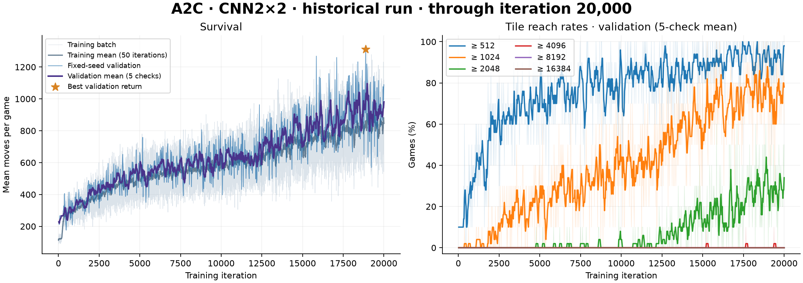
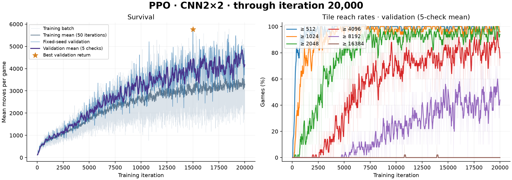
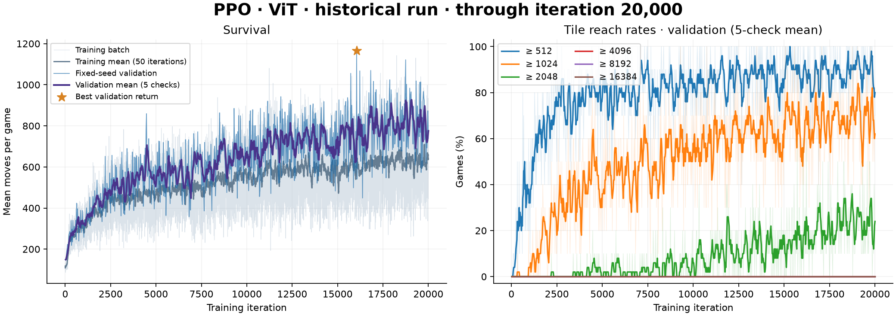
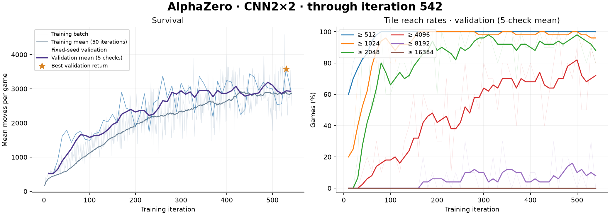
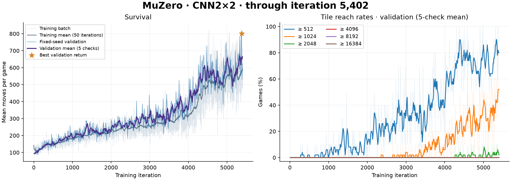

# 2048-rl-lab

**English** | [简体中文](README.zh-CN.md)

**Search and reinforcement learning on a shared 2048 environment.**

A compact research codebase with independent algorithm implementations, recorded learning curves, reproducible training, and pretrained models. The objective is longer survival and greater accumulated tile mass.

## Algorithms

| Method | Core procedure | Displayed model |
| --- | --- | --- |
| [MCTS](algorithms/mcts_chance.py) | UCT action selection, resampled tile spawns, full random rollouts | No neural network |
| [A2C](algorithms/a2c.py) | Fresh episodes, TD(λ) advantages, one actor–critic update | CNN2×2 |
| [PPO](algorithms/ppo.py) | TD(λ) advantages, clipped updates, shuffled minibatches, KL guard | CNN2×2 / ViT |
| [AlphaZero](algorithms/alphazero.py) | Search with the game rules, root-visit policy targets, D4 augmentation | CNN2×2 |
| [MuZero](algorithms/muzero.py) | Learned representation and dynamics, latent search, recurrent training | CNN2×2 |

## Recorded results



| Method / model | Search / move | Mean moves | ≥2048 | ≥4096 | ≥8192 | ≥16384 |
| --- | ---: | ---: | ---: | ---: | ---: | ---: |
| MCTS | 100 | 1,103.6 | 30% | 0% | 0% | 0% |
| A2C · CNN2×2 † | 0 | 1,311.6 | 60% | 0% | 0% | 0% |
| PPO · CNN2×2 | 0 | 5,765.4 | 100% | 100% | 80% | 0% |
| PPO · ViT † | 0 | 1,165.5 | 60% | 0% | 0% | 0% |
| AlphaZero · CNN2×2 | 100 | 3,576.4 | 90% | 90% | 30% | 0% |
| MuZero · CNN2×2 | 100 | 800.5 | 0% | 0% | 0% | 0% |

All rows use **10 games with environment seeds `1000000…1000009`**. MCTS was evaluated at 100 simulations per move; AlphaZero and MuZero also use 100 simulations. A2C/PPO use the policy directly. The neural rows are the validation results of the bundled checkpoints, so they include checkpoint-selection effects. Training budgets differ; this is a descriptive comparison, not a controlled ranking.

**Snapshot: 2026-09-22.** A2C/PPO logs contain 20,000 iterations; AlphaZero and MuZero are ongoing-run snapshots through iterations 542 and 5,402. † A2C/CNN2×2 and PPO/ViT were recorded before the current training defaults and are retained as historical results. Their difference cannot be attributed solely to architecture. Checkpoint iterations, per-game outcomes, and provenance are in [results.json](assets/results.json); MCTS outcomes are in [mcts.json](assets/mcts.json).

The following figures are regenerated from the published [log snapshots](assets/logs). The left panel shows training and validation episode length; the right panel shows inclusive tile-reaching rates from **512 through 16384**, extending automatically for larger tiles. Faint lines are raw observations; solid lines average 50 training iterations or five validation checks. The star marks the highest validation spawn return. Reaching a tile in one game does not imply that the selected checkpoint reaches it reliably. MCTS has no training curve and appears in the overview above.

### A2C · CNN2×2



### PPO · CNN2×2



### PPO · ViT



### AlphaZero · CNN2×2



### MuZero · CNN2×2



## Installation

Requires **Python 3.10+**. Run commands from the repository root.

```sh
git clone https://github.com/differentialmanifold/2048-rl-lab.git
cd 2048-rl-lab
python3 -m venv .venv
.venv/bin/python -m pip install -r requirements.txt
```

Training automatically selects **CUDA → Apple MPS → CPU**, based on available PyTorch backends. CPU worker count is chosen from the machine's cores and number of games. Collection and validation workers run on CPU; the parent performs training updates on the selected device. Optional overrides: `--device cpu`, `--device mps`, `--device cuda:0`, `--workers 2`.

## Environment and training objective

The game starts with one tile on a 4×4 board. Each valid move spawns 2 with probability 0.9 or 4 with probability 0.1; reaching 2048 does not end the game. Illegal actions are masked. The reward is **spawned tile mass**: 2 or 4 per valid move. Merges preserve mass, so final board sum equals initial mass plus cumulative reward.

All neural trainers default to **TD(λ), n=10, λ=0.5, γ=0.999**. Value targets mix one- through ten-step returns. A2C/PPO bootstrap from the frozen collection critic; AlphaZero/MuZero use recorded search values. Rewards and values use units of spawn mass / 128; logs report raw returns. True terminal bootstrap is zero. MuZero separately learns raw immediate rewards and zero-reward terminal tails.

## Train from scratch

`--iterations` is a finite total iteration target. Each fresh run needs its own output directory. The five commands below use the current defaults, including `--td-steps 10 --td-lambda 0.5 --gamma 0.999`.

```sh
# A2C · CNN2×2
.venv/bin/python -m algorithms.a2c \
  --architecture cnn2x2 --seed 0 --iterations 20000 \
  --save-dir checkpoints/a2c_cnn2x2_td_seed0

# PPO · CNN2×2
.venv/bin/python -m algorithms.ppo \
  --architecture cnn2x2 --seed 0 --iterations 20000 \
  --save-dir checkpoints/ppo_cnn2x2_td_seed0

# PPO · ViT
.venv/bin/python -m algorithms.ppo \
  --architecture vit --seed 0 --iterations 20000 \
  --save-dir checkpoints/ppo_vit_td_seed0

# AlphaZero · CNN2×2
.venv/bin/python -m algorithms.alphazero \
  --architecture cnn2x2 --seed 0 --iterations 20000 \
  --save-dir checkpoints/alphazero_cnn2x2_td_seed0

# MuZero · CNN2×2
.venv/bin/python -m algorithms.muzero \
  --architecture cnn2x2 --seed 0 --iterations 20000 \
  --save-dir checkpoints/muzero_cnn2x2_td_seed0
```

| Trainer | Games / iteration | Parameter updates | Validation / plot interval |
| --- | ---: | --- | ---: |
| A2C | 8 | One full-batch step | 25 iterations |
| PPO | 8 | Up to four minibatch passes; batch 256, KL threshold 0.02 | 25 iterations |
| AlphaZero | 8 | 100 minibatches of 256; replay 20,000 states | 10 iterations |
| MuZero | 8 | 100 minibatches of 64; five-step model unroll; replay 128 games | 10 iterations |

Validation uses ten fixed-seed games and also runs at completion. Search trainers use 100 simulations per move. `--eval-every`, `--eval-episodes`, `--plot-every`, and `--mcts-sims` override the relevant defaults. Training seed 0 identifies an experiment; individual game seeds change each iteration.

### Resume

```sh
.venv/bin/python -m algorithms.ppo \
  --resume checkpoints/ppo_cnn2x2_td_seed0/last.pt --iterations 30000
```

If 20,000 iterations are complete, this adds 10,000. Architecture and unspecified hyperparameters are restored along with optimizer/RNG state and, for search trainers, replay. Resume requires matching model and TD settings. Use a new `--save-dir` when changing the evaluation protocol so a new baseline is measured. Keep one writer per output directory.

| Output | Purpose |
| --- | --- |
| `metrics.jsonl` | Completed training iterations and scheduled validation |
| `last.pt` | Full checkpoint for resuming |
| `best.pt` | Highest mean validation spawn return under the current protocol |
| `training.png` | Replaced periodically and at completion |

```sh
.venv/bin/python plot.py --logs checkpoints/ppo_cnn2x2_td_seed0/metrics.jsonl
.venv/bin/python plot.py --logs assets/logs/ppo_cnn2x2.jsonl \
  --output assets/ppo_cnn2x2.png --title 'PPO · CNN2×2'
.venv/bin/python plot.py --results assets/results.json --output assets/overview.png
```

## Inspect pretrained agents

The bundled CNN2×2 checkpoint is the default for each neural agent. PPO also provides ViT. Interactive sessions use **fresh randomness on every launch**; `--seed` is optional for reproducing a game.

```sh
.venv/bin/python play.py --agent mcts --budget 100
.venv/bin/python play.py --agent a2c
.venv/bin/python play.py --agent ppo
.venv/bin/python play.py --agent ppo --checkpoint pretrained/ppo_vit.pt
.venv/bin/python play.py --agent alphazero --budget 100
.venv/bin/python play.py --agent muzero --budget 100
```

Press Enter for one agent move, `H` for a suggestion, `W/A/S/D` for a manual move, `P` for autoplay, or `Q` to exit. Add `--auto --delay 0.05` to watch a complete game. To inspect your own training run, pass `--checkpoint checkpoints/<run>/best.pt`.

Bundled weights are inference-only and cannot resume training. Export a new model with:

```sh
.venv/bin/python -m common.checkpoints \
  --input checkpoints/ppo_cnn2x2_td_seed0/best.pt --output pretrained/ppo_cnn2x2.pt
```

## Evaluate

Use a separate seed range for testing:

```sh
.venv/bin/python evaluate.py --agent ppo --checkpoint pretrained/ppo_cnn2x2.pt \
  --episodes 100 --seed 2000000 --output experiments/ppo_cnn2x2.json

.venv/bin/python evaluate.py --agent mcts --budget 100 \
  --episodes 10 --seed 2000000 --output experiments/mcts.json

.venv/bin/python evaluate.py --agent alphazero --budget 100 \
  --episodes 10 --seed 2000000 --output experiments/alphazero.json

.venv/bin/python evaluate.py --agent muzero --budget 100 \
  --episodes 10 --seed 2000000 --output experiments/muzero.json
```

The output reports mean moves, spawned mass, final board sum, and inclusive tile-reaching rates. Search budget is recorded alongside the result. Standalone evaluation defaults to CPU and accepts `--device auto`; multiple workers use CPU.

## Models and layout

Both encoders use tile-exponent embeddings and output 256 features. CNN2×2 applies two unpadded convolutions, **4×4 → 3×3 → 2×2**, with **64 → 128** channels, a projected residual, GroupNorm and SiLU. ViT uses 16 cell tokens, width 96, two four-head transformer blocks, axial 2D RoPE, and ordered cell readout.

| Model | Actor–critic parameters | MuZero parameters |
| --- | ---: | ---: |
| CNN2×2 | 173,893 | 240,326 |
| ViT | 187,085 | 253,518 |

| Location | Responsibility |
| --- | --- |
| `algorithms/` | Independent MCTS, A2C, PPO, AlphaZero, and MuZero flows |
| `common/models.py`, `common/targets.py`, `common/rollout.py` | Encoders, TD targets, batched game collection |
| `common/evaluation.py`, `common/parallel.py` | Evaluation and persistent CPU workers |
| `common/training.py`, `common/checkpoints.py` | Configuration, resume, checkpoints and logging |
| `board.py`, `gym2048_env.py` | Game rules and Gymnasium interface |
| `play.py`, `evaluate.py`, `plot.py` | Interactive inspection, evaluation, plots |
| `assets/`, `pretrained/` | Published results/log snapshots and inference weights |
| `checkpoints/`, `experiments/` | Local training artifacts, excluded from Git |

```sh
.venv/bin/python -m pytest -q
```

## License

[MIT](LICENSE). Copyright © 2026 differentialmanifold.
