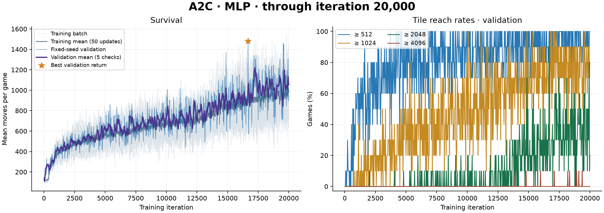
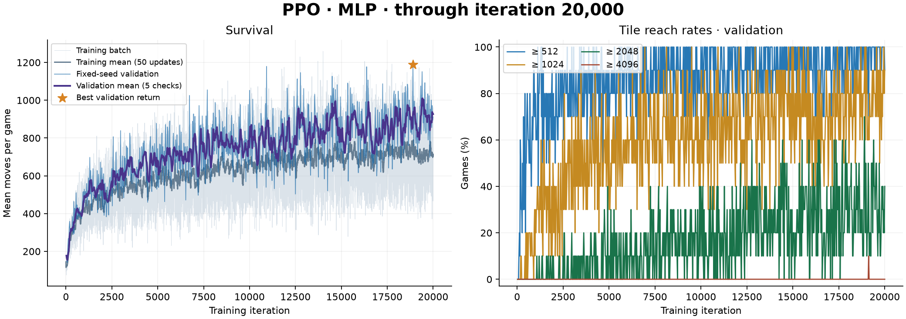
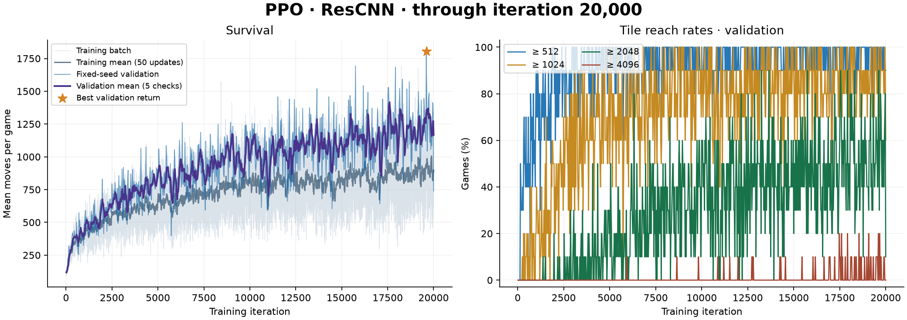

# 2048-rl-lab

**English** | [简体中文](README.zh-CN.md)

**Study search and reinforcement learning on a shared 2048 environment.**

2048-rl-lab is a research codebase for examining how search budgets, policy optimization, and network architecture affect performance in a stochastic sequential decision problem. It provides independent algorithm implementations, reproducible training and evaluation, recorded learning curves, and pretrained checkpoints for inspecting learned behavior.

## Research scope

| Method | Implementation | Model / computation |
| --- | --- | --- |
| [Monte Carlo Tree Search](algorithms/mcts.py) | UCT selection, legal-action expansion, random rollouts, and backup | No neural network; configurable rollouts per move |
| [Advantage Actor–Critic (A2C)](algorithms/a2c.py) | Complete-episode collection, GAE, and one full-batch update | MLP, 133,381 parameters |
| [Proximal Policy Optimization (PPO)](algorithms/ppo.py) | GAE, shuffled minibatches, clipped policy objective, and KL guard | MLP / ResCNN, 133,381 / 175,877 parameters |

The code supports studying policy learning versus online search, the effect of MLP and convolutional representations, and the relationship between survival, tile mass, and tile-reaching rates. Algorithm-specific training loops remain in their own files; shared modules handle models, trajectories, evaluation, and checkpoint management.

## Experimental results

These figures are regenerated from the recorded training logs. The left panel shows mean episode length; the right panel shows the fraction of validation games reaching **512, 1024, 2048, and 4096**. Thresholds are inclusive: a game reaching 2048 also counts toward 512 and 1024.

| Method / model | Training iterations | Selected checkpoint | Validation games | Mean moves | ≥2048 | ≥4096 |
| --- | ---: | ---: | ---: | ---: | ---: | ---: |
| A2C / MLP | 20,000 | 16,675 | 10 | 1,479.8 | 90% | 0% |
| PPO / MLP | 20,000 | 18,900 | 10 | 1,188.3 | 70% | 0% |
| PPO / ResCNN | 20,000 | 19,600 | 10 | 1,804.1 | 90% | 20% |

**Evaluation protocol:** the reported runs use training seed 0 and fixed validation environment seeds `1000000…1000009`. Checkpoints are selected by mean cumulative spawned tile mass. These are **checkpoint-selection validation results**, not held-out test results or averages over multiple training seeds. They do not establish a general ranking of algorithms or architectures. Checkpoint metadata and per-game records are available in [results.json](assets/results.json).

### A2C · MLP



### PPO · MLP



### PPO · ResCNN



The horizontal axis is the training iteration, not a game or an individual optimizer step. The survival panel includes raw training values, a trailing mean over 50 iterations, fixed-seed validation, and a trailing mean over 5 validation checks. The star identifies the checkpoint with the highest validation return, which need not have the highest mean survival. MCTS has no training curve; its performance is evaluated at a specified search budget.

## Environment and objective

The [Gymnasium environment](gym2048_env.py) uses a 4×4 board and four directional actions. Illegal actions are masked. The environment starts with **one tile**; each valid move spawns a 2 with probability 0.9 or a 4 with probability 0.1. Games continue past 2048 until no legal move remains.

The current learning objective is **cumulative spawned tile mass**, encouraging longer survival and greater final board mass. Rewards are divided by 128 internally, with `gamma=1` and GAE `lambda=0.95` by default. Reported returns use the original, unscaled values.

| Metric | Definition |
| --- | --- |
| `steps` / `mean_steps` | Episode length / average episode length |
| `spawn_return` / `mean_return` | Cumulative value of spawned tiles / its episode average |
| `board_sum` | Sum of all tiles on the final board; initial mass plus spawned mass |
| `merge_score` | Standard 2048 score: sum of the resulting tile values across all merges |
| `p512`, `p1024`, `p2048`, `p4096` | Fraction of games reaching at least the specified tile |

`mean_score` in older logs is an alias for `mean_return`, **not** the standard merge score. Studies using standard 2048 scores should compare `merge_score`. The one-tile initial condition also needs to be aligned before comparing against experiments that start with two tiles.

## Installation

Requires **Python 3.10+**. Run commands from the repository root:

```sh
git clone https://github.com/differentialmanifold/2048-rl-lab.git
cd 2048-rl-lab
python3 -m venv .venv
.venv/bin/python -m pip install -r requirements.txt
```

CPU is the default device. Use `--device cuda` for a compatible GPU environment.

## Training

`--iterations` specifies a required, finite **total iteration target**. Use a new output directory for each fresh experiment.

```sh
# A2C / MLP
.venv/bin/python -m algorithms.a2c \
  --architecture mlp --seed 0 --iterations 20000 \
  --episodes-per-update 8 --eval-every 25 --eval-episodes 10 \
  --plot-every 25 --save-dir checkpoints/a2c_mlp

# PPO / MLP
.venv/bin/python -m algorithms.ppo \
  --architecture mlp --seed 0 --iterations 20000 \
  --episodes-per-update 8 --epochs 4 --batch-size 256 \
  --eval-every 25 --eval-episodes 10 --plot-every 25 \
  --save-dir checkpoints/ppo_mlp

# PPO / ResCNN
.venv/bin/python -m algorithms.ppo \
  --architecture rescnn --seed 0 --iterations 20000 \
  --episodes-per-update 8 --epochs 4 --batch-size 256 \
  --eval-every 25 --eval-episodes 10 --plot-every 25 \
  --save-dir checkpoints/ppo_rescnn
```

Each iteration collects eight complete games before updating. A2C makes one full-batch optimizer step. PPO makes up to four passes through shuffled minibatches; the default KL threshold of `0.02` can end optimization of the current batch early. Validation runs after every 25 iterations and at the final iteration, using the updated policy's highest-probability legal action.

Training seeds vary by episode: `10000000 + seed + iteration × 100000 + episode_index`. Fixing the experiment seed makes a run reproducible within the same execution setup; it does not repeat the same board every episode.

### Batched collection and CPU workers

A2C/PPO now advance multiple complete games together and infer their active boards as a batch. Each visited state is evaluated once; the following state's stored value supplies the GAE bootstrap. True termination uses zero, while time-limit truncation still evaluates its final state. Advantages are normalized across the entire update, including all workers.

Worker count is automatic; no `--workers` argument is needed. The CPU budget respects process affinity where available and uses the performance-core count on Apple Silicon (physical-core count on other Macs). One core is reserved, then the count is capped by games per update. For example, 12 performance cores and 8 games select 8 workers. A single game runs in-process. This is a hardware-based heuristic, not a benchmark-derived optimum.

Persistent CPU workers each batch their assigned games. Model parameters remain frozen during collection; optimization runs only in the parent process after every game completes. Worker inference uses CPU even if the parent trains on an accelerator. Policy validation reuses these workers. Startup output and training logs report the selected count. `--workers N` remains an optional override; `--workers 1` forces in-process batching. Resume re-detects the current machine rather than inheriting the checkpoint's old worker count; specify an override when reproducing a particular execution configuration.

```sh
.venv/bin/python -m algorithms.ppo \
  --architecture rescnn --seed 0 --iterations 20000 \
  --episodes-per-update 8 \
  --eval-every 25 --eval-episodes 10 --plot-every 25 \
  --save-dir checkpoints/ppo_rescnn_parallel

# Continue an existing A2C experiment with CPU workers.
.venv/bin/python -m algorithms.a2c \
  --resume checkpoints/a2c_2048_v3/last.pt --iterations 30000 \
  --save-dir checkpoints/a2c_mlp_parallel
```

Each episode has an independent action RNG derived from its episode seed; results are merged in episode order. Fixed configurations support reproducible resume. Compared with the earlier serial collector, action sampling and floating-point batch operations have changed, so new runs do not reproduce historical trajectories bit for bit. The published figures remain historical results. Changing worker counts or devices may also change floating-point results. Small workloads may not benefit from multiprocessing; compare `collect_seconds` and `update_seconds` in the logs. `validation.seconds` reports evaluation wall time.

The standalone evaluator also selects CPU workers automatically, capped by its episode count, including for rollout MCTS. Changing validation seeds, episode count, or search budget on resume requires a fresh `--save-dir`; the resumed model is re-evaluated before selecting a new best checkpoint.

### Resume an experiment

```sh
.venv/bin/python -m algorithms.ppo \
  --resume checkpoints/ppo_rescnn/last.pt --iterations 30000 --plot-every 25
```

If 20,000 iterations have completed, this runs 10,000 more. Architecture and unspecified hyperparameters are inherited. Existing v3 checkpoints, such as `checkpoints/ppo_rescnn_seed0/last.pt` and `checkpoints/a2c_2048_v3/last.pt`, remain compatible with the corresponding trainer. Add a new `--save-dir` to branch from an older checkpoint. Only one process should write to a training directory.

### Checkpoints and plots

| Output | Purpose |
| --- | --- |
| `metrics.jsonl` | One record per completed iteration, with validation when scheduled |
| `last.pt` | Latest model, optimizer, and RNG state for resuming |
| `best.pt` | Model with the highest mean validation return |
| `training.png` | Overwritten every `--plot-every` iterations and at the final iteration |

Plotting and validation have independent intervals. Replot existing logs or update the figures displayed above:

```sh
.venv/bin/python plot.py --logs checkpoints/a2c_2048_v3/metrics.jsonl --output assets/a2c_mlp.png --title 'A2C · MLP'
.venv/bin/python plot.py --logs checkpoints/ppo_2048_v3/metrics.jsonl --output assets/ppo_mlp.png --title 'PPO · MLP'
.venv/bin/python plot.py --logs checkpoints/ppo_rescnn_seed0/metrics.jsonl --output assets/ppo_rescnn.png --title 'PPO · ResCNN'
```

The result table and `assets/results.json` describe the exported checkpoint snapshots; update them when replacing the reported models. Export a compact inference checkpoint with:

```sh
.venv/bin/python -m common.checkpoints \
  --input checkpoints/ppo_rescnn/best.pt --output pretrained/ppo_rescnn.pt
```

Bundled inference checkpoints are approximately 0.5–0.7 MB each. They do not contain optimizer or RNG state and cannot resume training. Full training checkpoints are generated locally and excluded from Git.

## Held-out evaluation

Use a separate seed range for full-game evaluation:

```sh
.venv/bin/python evaluate.py --agent ppo --checkpoint pretrained/ppo_rescnn.pt \
  --episodes 100 --seed 2000000 --output experiments/ppo_rescnn_test.json

.venv/bin/python evaluate.py --agent a2c --checkpoint pretrained/a2c_mlp.pt \
  --episodes 100 --seed 2000000 --output experiments/a2c_test.json

.venv/bin/python evaluate.py --agent mcts --budget 500 \
  --episodes 10 --seed 2000000 --output experiments/mcts_test.json
```

The output includes episode lengths, board mass, merge scores, and tile-reaching rates. Search evaluation can take substantially longer than policy-only inference. For comparative studies, keep environment rules and test seeds aligned and report search budgets alongside results.

## Inspect a learned policy

The terminal interface supports qualitative inspection of policy decisions. **Each launch uses fresh OS randomness by default** for the environment and search. No fixed seed is required.

```sh
.venv/bin/python play.py --agent ppo --checkpoint pretrained/ppo_rescnn.pt
.venv/bin/python play.py --agent ppo --checkpoint pretrained/ppo_mlp.pt
.venv/bin/python play.py --agent a2c --checkpoint pretrained/a2c_mlp.pt
.venv/bin/python play.py --agent mcts --budget 500
```

Press Enter for one agent move, `H` for a suggestion, `W/A/S/D` followed by Enter for a manual move, `P` for automatic continuation, or `Q` to exit. Add `--auto --delay 0.05` to observe a full episode. The displayed session seed can optionally be supplied with `--seed` when reproducing a particular trajectory.

## Models and code organization

Both models use tile-exponent embeddings, legal-action masking, and policy/value heads. The [MLP](common/models.py) has two 256-unit hidden layers. The ResCNN adds a numeric rank channel to the embeddings, applies a 32-channel convolution and two residual blocks, then projects the flattened features to 256 units.

| Location | Responsibility |
| --- | --- |
| `algorithms/` | Independent search and training implementations |
| `common/models.py` | Network architectures and masked action distributions |
| `common/rollout.py` | Complete-episode collection and GAE targets |
| `common/evaluation.py` | Fixed-seed evaluation |
| `common/parallel.py` | Persistent CPU workers and frozen model snapshots |
| `common/training.py`, `common/checkpoints.py` | Experiment configuration, persistence, logging, and periodic plots |
| `board.py`, `gym2048_env.py` | Game rules and Gymnasium interface |
| `evaluate.py`, `plot.py`, `play.py` | Evaluation, visualization, and policy inspection |
| `assets/`, `pretrained/`, `checkpoints/` | Result figures, inference weights, and recorded experiment logs |
| `tests/` | Algorithm, reproducibility, checkpoint, and output regression tests |

```sh
.venv/bin/python -m pytest -q
```

## License

[MIT](LICENSE). Copyright © 2026 differentialmanifold.
