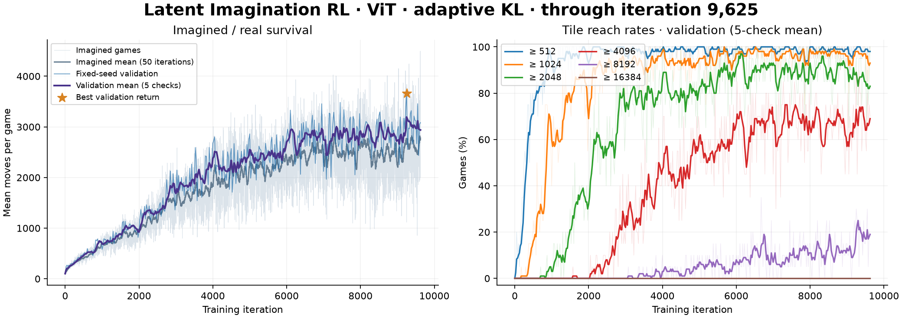

# Latent Imagination RL

**English** | [简体中文](latent-imagination.zh-CN.md)

The [implementation](../algorithms/latent_imagination/) constructs a neural world model and learns a policy through imagined games in continuous latent space. The world predicts action effects, random spawns, rewards, legal directions and termination. The policy uses ViT or CNN2×2; the current optimizer is PPO with candidate afterstate representations.

Imagined games encode a board only at reset, then advance through learned dynamics. Board rules and decoding provide offline supervision and acceptance checks. The world stays frozen during policy optimization; real games evaluate the policy and select `best.pt`.

## Construct the world

```sh
.venv/bin/python -m algorithms.latent_imagination.pipeline world \
  --run-dir checkpoints/latent_world_seed0 \
  --device mps --workers 8 --seed 0 \
  --bootstrap-iterations 10000 \
  --episodes 64 --horizon 10 --trajectory-updates 2000 \
  --max-trajectory-updates 0 \
  --eval-every 200 --plot-every 25 --refresh-every 1000
```

`pipeline world` automatically connects three stages:

1. **Base fitting**: generate synthetic and boundary boards, fit the tokenizer and 1-, 3- and 10-step dynamics.
2. **Exploration**: train an initial policy in the base model to produce long recurrent latent trajectories.
3. **Trajectory fitting**: add supervision from these trajectories and continue fitting dynamics, event probabilities and state readouts. The tokenizer stays frozen; legality shares the event prior.

Trajectory fitting is a normal world-construction stage. Each stage advances after acceptance; repeat the command to resume. `--trajectory-updates` is a minimum; `--max-trajectory-updates 0` sets no upper limit.

The directory contains `base/`, `exploration/` and the final `world/`, with progress in `world_pipeline.json`. Reuse an accepted base model with `--base-world <directory>` and optionally its policy with `--policy-checkpoint <checkpoint>`. Once complete, pass the construction directory directly as `--world-run`.

## Learn in latent space

### ViT · adaptive learning rate

```sh
.venv/bin/python -m algorithms.latent_imagination.pipeline imagine \
  --world-run checkpoints/latent_world_seed0 \
  --architecture vit \
  --save-dir checkpoints/latent_imagination_vit_seed0 \
  --iterations 20000 --device mps --workers 8 --seed 0 \
  --episodes-per-update 8 --epochs 4 --batch-size 256 \
  --gamma 0.999 --td-steps 10 --td-lambda 0.5 \
  --lr 3e-4 --lr-schedule adaptive_kl \
  --lr-min 1e-6 --lr-max 3e-4 --lr-patience 5 \
  --clip-range 0.2 --target-kl 0.02 \
  --entropy-coef 0.01 --value-coef 0.5 \
  --eval-every 25 --eval-episodes 20 --plot-every 25
```

After 5 updates with rollout KL above 1.5 times the target, or KL stopping before one full pass, `adaptive_kl` multiplies the learning rate by 0.8. After 5 complete updates with KL below half the target, it multiplies by 1.1. Bounds are `[1e-6, 3e-4]`.

### CNN2×2 · constant learning rate

```sh
.venv/bin/python -m algorithms.latent_imagination.pipeline imagine \
  --world-run checkpoints/latent_world_seed0 \
  --architecture cnn2x2 \
  --save-dir checkpoints/latent_imagination_cnn2x2_seed0 \
  --iterations 20000 --device mps --workers 8 --seed 0 \
  --episodes-per-update 8 --epochs 4 --batch-size 256 \
  --gamma 0.999 --td-steps 10 --td-lambda 0.5 \
  --lr 3e-4 --lr-schedule constant \
  --clip-range 0.2 --target-kl 0.02 \
  --entropy-coef 0.01 --value-coef 0.5 \
  --eval-every 25 --eval-episodes 20 --plot-every 25
```

Both policies share the world: 8 imagined games per iteration, up to 4 minibatch passes, TD(10, 0.5), γ=0.999 and 20 real validation games every 25 iterations. The architecture and learning-rate schedule both differ.

## Resume, evaluate and play

```sh
.venv/bin/python -m algorithms.latent_imagination.pipeline imagine \
  --resume checkpoints/latent_imagination_vit_seed0/last.pt \
  --iterations 20000 --device mps --workers 8

.venv/bin/python evaluate.py --agent latent_imagination \
  --checkpoint checkpoints/latent_imagination_vit_seed0/best.pt \
  --episodes 100 --seed 2000000 --workers 8 \
  --output experiments/latent_imagination_vit_test.json

.venv/bin/python play.py --agent latent_imagination \
  --checkpoint checkpoints/latent_imagination_vit_seed0/best.pt --auto
```

Resume restores the world, policy, optimizer and learning-rate controller. Substitute the CNN2×2 directory for that run. Existing checkpoints also resume through the new entry point using their original `last.pt` path.

Outputs: `last.pt`, `best.pt`, `metrics.jsonl`, `training.png` and `optimization.png`. Keep one writer per training directory.

## Current results

The snapshot uses a previously trained base world and exploration policy. Fresh commands have different initialization and training history.

2026-10-07 snapshot: ViT adaptive KL through iteration 9,625, CNN2×2 constant LR through 11,275; both target 20,000. The table reports their best real-environment validation over 20 fixed-seed games. Refresh the published logs and plots after training completes.

| Policy | Best iteration | Mean moves | Spawn return | ≥4096 | ≥8192 |
| --- | ---: | ---: | ---: | ---: | ---: |
| ViT · adaptive KL | 9,250 | 3,666.55 | 8,074.0 | 90% | 30% |
| CNN2×2 · constant | 10,825 | 3,912.35 | 8,612.0 | 90% | 35% |


