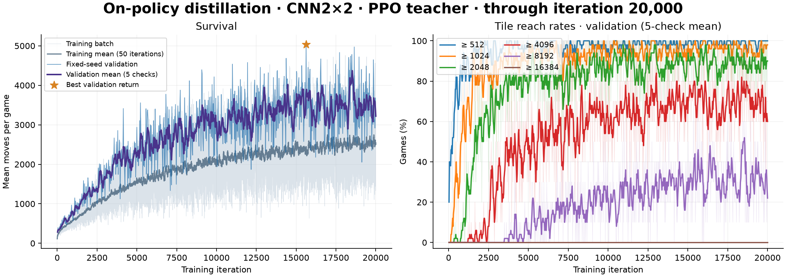

# On-policy distillation

**English** | [简体中文](on-policy-distillation.zh-CN.md)

[Implementation](../algorithms/opd.py): a CNN2×2 student collects fresh games, queries a teacher on the states it visits, then updates from those labels. The student samples every environment action. Trajectories are discarded after the update.

| Teacher | Action distribution |
| --- | --- |
| `ppo` | A frozen PPO checkpoint's legal-action probabilities |
| `alphazero` | Root visits from PUCT using the current student's policy and value heads |

The default `--loss sampled` uses the immediate signal `log teacher(a|s) − log student_old(a|s)` and an importance ratio to minimize reverse KL. `--loss exact` sums reverse KL over all legal actions. Environment rewards train the value head with the project's TD(λ) targets; they do not enter the distillation advantage. Minibatch updates stop at the configured KL threshold.

## Train

```sh
# Frozen PPO teacher; randomly initialized student
.venv/bin/python -m algorithms.opd \
  --teacher ppo --teacher-checkpoint pretrained/ppo_cnn2x2.pt \
  --architecture cnn2x2 --seed 0 --iterations 20000 \
  --save-dir checkpoints/opd_ppo_cnn2x2

# Current-student AlphaZero search teacher
.venv/bin/python -m algorithms.opd \
  --teacher alphazero --mcts-sims 100 --seed 0 --iterations 20000 \
  --save-dir checkpoints/opd_alphazero_cnn2x2
```

The PPO teacher can use CNN2×2 or ViT. `--init-checkpoint` initializes student weights for a new run. Resume restores optimizer/RNG state and the embedded frozen teacher; AlphaZero mode always queries the current student. Search labels use smoothed legal root visits to keep reverse KL finite.

```sh
.venv/bin/python -m algorithms.opd \
  --resume checkpoints/opd_ppo_cnn2x2/last.pt --iterations 30000

.venv/bin/python evaluate.py --agent opd \
  --checkpoint pretrained/opd_cnn2x2.pt \
  --episodes 100 --seed 2000000 --output experiments/opd_test.json

.venv/bin/python play.py --agent opd --auto
```

## Recorded result

The PPO-teacher run completed 20,000 iterations. Its best validation checkpoint at iteration 15,625 averages 5,033.8 moves over 10 fixed-seed games (`1000000…1000009`), reaching 4096 in 90% and 8192 in 80%. Evaluation uses the student's direct policy without search.

The bundled weights are inference-only. Records are in [results.json](../assets/results.json).


