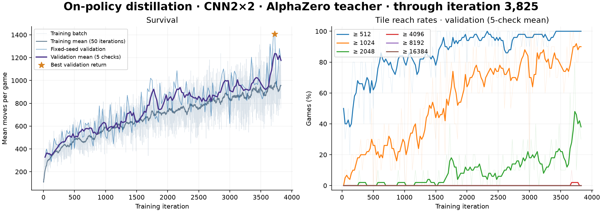

# On-policy distillation

[English](on-policy-distillation.md) | **简体中文**

[实现](../algorithms/opd.py)：CNN2×2 学生采集新对局，在自己访问的状态上查询教师，再根据教师标签更新。环境中的所有动作都由学生采样，每轮更新后丢弃轨迹。

| 教师 | 动作分布 |
| --- | --- |
| `ppo` | 冻结 PPO checkpoint 的合法动作概率 |
| `alphazero` | 当前学生的策略与价值头参与 PUCT，使用根节点访问次数 |

默认 `--loss sampled` 使用即时信号 `log teacher(a|s) − log student_old(a|s)` 与 importance ratio 最小化反向 KL；`--loss exact` 对全部合法动作精确求和。环境奖励沿用项目的 TD(λ) 目标训练价值头，不参与蒸馏优势。minibatch 更新受配置的 KL 阈值约束。

## 训练

```sh
# 冻结 PPO 教师，学生随机初始化
.venv/bin/python -m algorithms.opd \
  --teacher ppo --teacher-checkpoint pretrained/ppo_cnn2x2.pt \
  --architecture cnn2x2 --seed 0 --iterations 20000 \
  --save-dir checkpoints/opd_ppo_cnn2x2

# 当前学生的 AlphaZero 搜索教师
.venv/bin/python -m algorithms.opd \
  --teacher alphazero --mcts-sims 100 --seed 0 --iterations 20000 \
  --save-dir checkpoints/opd_alphazero_cnn2x2
```

PPO 教师支持 CNN2×2 或 ViT。`--init-checkpoint` 可为新实验初始化学生权重。续训恢复优化器、随机状态及 checkpoint 内的冻结教师；AlphaZero 模式始终查询当前学生。搜索标签对合法动作的根节点访问分布做平滑，保持反向 KL 有限。

```sh
.venv/bin/python -m algorithms.opd \
  --resume checkpoints/opd_ppo_cnn2x2/last.pt --iterations 30000

.venv/bin/python evaluate.py --agent opd \
  --checkpoint pretrained/opd_cnn2x2.pt \
  --episodes 100 --seed 2000000 --output experiments/opd_test.json

.venv/bin/python play.py --agent opd --auto
```

## 已记录结果

PPO 教师训练已完成 20,000 轮。最佳验证 checkpoint 为第 15,625 轮，10 局固定 seed（`1000000…1000009`）平均 5,033.8 步，≥4096 为 90%，≥8192 为 80%。评估直接使用学生策略，不进行搜索。

附带权重仅供推理，数据见 [results.json](../assets/results.json)。


AlphaZero 教师版本仍在训练，2026-10-11 快照至第 3,825 轮／目标 20,000 轮；最佳验证位于第 3,725 轮，10 局平均 1,406.8 步，≥2048 为 80%。验证同样不进行搜索。


