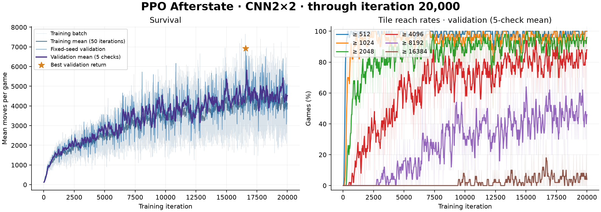

# PPO Afterstate

[English](ppo-afterstate.md) | **简体中文**

[实现](../algorithms/ppo_afterstate.py)将一步移动分成确定性移动合并和随机落子。策略先计算四个方向的候选 afterstate，用共享 CNN2×2 或 ViT 编码器评分，再屏蔽非法动作、选择方向；随机块随后生成。

价值头估计每个 afterstate 的预期回报，包含接下来的落子奖励。决策状态的价值是各候选价值按策略概率的加权平均。训练使用 PPO 裁剪目标与 TD(10, 0.5)，γ=0.999；内部奖励和价值除以 128，报告使用原始 spawn mass。

## 训练

```sh
.venv/bin/python -m algorithms.ppo_afterstate \
  --architecture cnn2x2 --seed 0 --iterations 20000 \
  --device auto --workers 8 \
  --save-dir checkpoints/ppo_afterstate_cnn2x2_td_seed0_klfix
```

默认每轮 8 局、最多 4 遍 minibatch 更新，batch=256，学习率 3e-4，clip=0.2，entropy=0.01，value=0.5，KL 阈值 0.02。每 25 轮验证并绘图，验证使用 10 局固定 seed。CPU worker 采集对局，主进程在所选设备更新。

## 续训与试玩

```sh
.venv/bin/python -m algorithms.ppo_afterstate \
  --resume checkpoints/ppo_afterstate_cnn2x2_td_seed0_klfix/last.pt \
  --iterations 30000 --workers 8

.venv/bin/python play.py --agent ppo_afterstate --auto

.venv/bin/python evaluate.py --agent ppo_afterstate \
  --checkpoint pretrained/ppo_afterstate_cnn2x2.pt \
  --episodes 100 --seed 2000000 --workers 8 \
  --output experiments/ppo_afterstate_test.json
```

`--iterations` 是累计训练目标；续训恢复模型、优化器和随机状态。输出包括 `last.pt`、按真实环境平均验证回报选择的 `best.pt`、`metrics.jsonl` 和 `training.png`。

## 已记录的结果

2026-10-07：CNN2×2 完成 20,000 轮，最佳 checkpoint 位于第 16,575 轮。10 局验证平均 6,930.7 步，spawn return 15,270.4；8192／16384 达成率为 90%／20%。这是训练期间选择 checkpoint 的验证结果。项目附带该最佳模型的推理权重。


