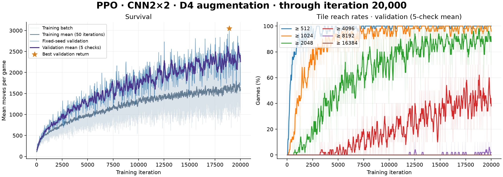

# PPO · D4 对称增强

[English](ppo-symmetry.md) | **简体中文**

[PPO](../algorithms/ppo.py) 可通过 `--symmetry d4` 加入旋转／镜像一致性约束。每条训练样本随机选择八种 D4 变换之一，将变换后的策略映射回原动作坐标，并让动作分布与价值预测接近原棋盘的预测；原预测停止梯度。

PPO 的概率比、优势和 TD 目标仍来自原始轨迹，变换棋盘只参与辅助损失。推理只进行一次前向，因此仍可能保留方向偏好。

## 训练

```sh
.venv/bin/python -m algorithms.ppo \
  --architecture cnn2x2 --seed 0 --iterations 20000 \
  --symmetry d4 --symmetry-policy-coef 0.1 --symmetry-value-coef 0.1 \
  --save-dir checkpoints/ppo_cnn2x2_d4_seed0
```

ViT 同样支持这个选项，`--symmetry none` 为普通 PPO。续训继承增强配置；切换模式时使用新的输出目录。

```sh
.venv/bin/python -m algorithms.ppo \
  --resume checkpoints/ppo_cnn2x2_d4_seed0/last.pt --iterations 20000

.venv/bin/python play.py --agent ppo \
  --checkpoint pretrained/ppo_d4_cnn2x2.pt --auto
```

## 已记录结果

已完成 20,000 轮。最佳验证 checkpoint 为第 18,900 轮，10 局固定 seed（`1000000…1000009`）平均 3,049.1 步，≥4096 为 80%，≥8192 为 10%。这项训练减轻了方向偏好，但仍有残留，且完整对局表现低于原 PPO。

附带权重仅供推理。逐局验证成绩和日志来源见 [results.json](../assets/results.json)。


